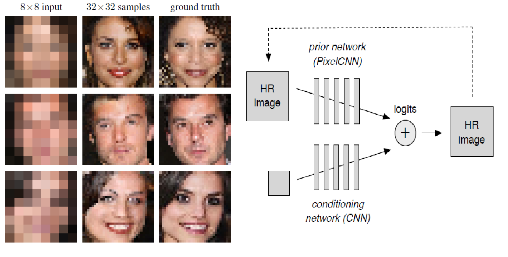
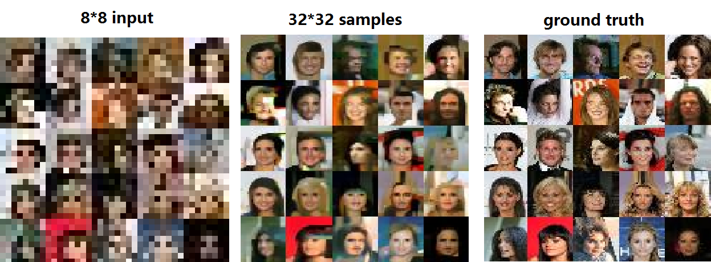
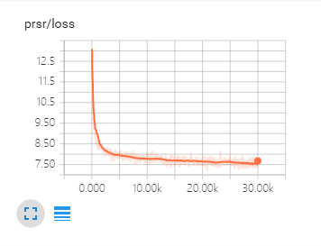

# Pixel Recursive Super Resolution

TensorFlow implementation of [Pixel Recursive Super Resolution](https://arxiv.org/abs/1702.00783). This implementation contains:

## Requirements

- Python 2.7
- [Skimage](http://scikit-image.org/)
- [TensorFlow](https://www.tensorflow.org/) 1.0

## Usage

First, download data [celebA](http://mmlab.ie.cuhk.edu.hk/projects/CelebA.html)

    $ mkdir data
	$ cd data
	$ ln -s $celebA_path celebA

Then, create image_list file:

	$ python tools/create_img_lists.py --dataset=data/celebA --outfile=data/train.txt

To train model on gpu:

	$ python tools/train.py
	(or $ python tools/train.py --device_id=0)

To train model on cpu:
	$ python tools/train.py --use_gpu=False

## Samples

Training after 30000 iteration.

## Training details

cross entropy loss:

## Author

nilboy / [@nilboy](https://github.com/nilboy)